# NT1100 PDI
dummyhead
2022 NT1100A/D
2022 NT1100A/D
2022 NT1100A/D

SET-UP INSTRUCTIONS

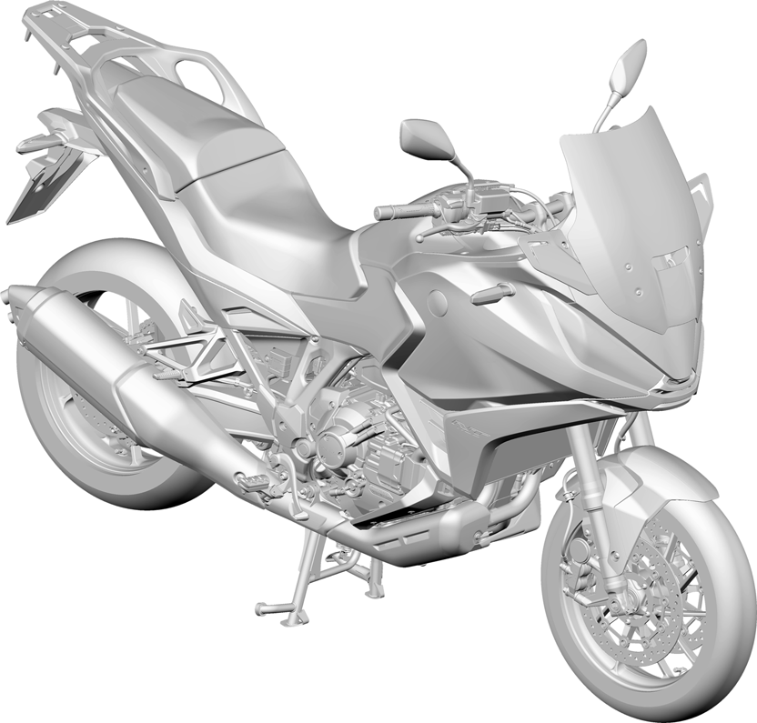
92MLF00

SET-UP AND PRE-DELIVERY SERVICE MUST

Honda Motor Co.,Ltd.2021

BE PERFORMED BY AN AUTHORIZED

Published by Honda Motor Co.,Ltd.

A DATA.2021.09

HONDA MOTORCYCLE DEALER.
0
dummyhead
2022 NT1100A/D

A Few Words About Safety

Service Information

The set-up and pre-delivery service information contained in this manual is intended for use by qualified, professional
technicians.

Attempting service or repairs without the proper training, tools, and equipment could cause injury to you or others. It
could also damage the vehicle or create an unsafe condition.

This manual describes the proper methods and procedures for performing set-up and pre-delivery. Some procedures
require the use of specially designed tools and dedicated equipment. Any person who intends to use a replacement
part, service procedure or a tool that is not recommended by Honda, must determine the risks to their personal safety
and the safe operation of the vehicle.

If you need to replace a part, use Honda genuine parts with the correct part number or an equivalent part. We strongly
recommend that you do not use replacement parts of inferior quality.

For Your Customer’s Safety

Proper set-up and pre-delivery are essential to the customer’s
safety and the reliability of the vehicle. Any error or oversight while

servicing a vehicle can result in faulty operation, damage to the

Improper set-up or pre-delivery service can create an
vehicle, or injury to others.
unsafe condition that can cause your customer to be
seriously hurt or killed.

For Your Safety

Follow the procedures and precautions in this manual

Because this manual is intended for the professional service
and the service manual carefully.
technician, we do not provide warnings about many basic shop
safety practices (e.g., Hot parts–wear gloves). If you have not
received shop safety training or do not feel confident about your
knowledge of safe servicing practice, we recommended that you

do not attempt to perform the procedures described in this manual.

Failure to properly follow instructions and precautions
can cause you to be seriously hurt or killed.

Some of the most important general service safety precautions are
given below. However, we cannot warn you of every conceivable

Follow the procedures and precautions in this manual
hazard that can arise in performing set-up and pre-delivery
carefully.
procedures. Only you can decide whether or not you should
perform a given task.

Important Safety Precautions

Make sure you have a clear understanding of all basic shop safety practices and that you are wearing appropriate
clothing and using safety equipment. When performing any service task, be especially careful of the following:
* Read all of the instructions before you begin, and make sure you have the tools, the replacement or repair parts,
and the skills required to perform the tasks safely and completely.
* Protect your eyes by using proper safety glasses, goggles or face shields any time you hammer, drill, grind, pry or
work around pressurized air or liquids, and springs or other stored-energy components. If there is any doubt, put on
eye protection.
* Use other protective wear when necessary, for example gloves or safety shoes. Handling hot or sharp parts can
cause severe burns or cuts. Before you grab something that looks like it can hurt you, stop and put on gloves.
* Protect yourself and others whenever you have the vehicle up in the air. Any time you lift the vehicle, either with a
hoist or a jack, make sure that it is always securely supported. Use jack stands.

Make sure the engine is off before you begin any servicing procedures, unless the instruction tells you to do otherwise.

This will help eliminate several potential hazards:
* Carbon monoxide poisoning from engine exhaust. Be sure there is adequate ventilation whenever you run the
engine
* Burns from hot parts or coolant. Let the engine and exhaust system cool before working in those areas.
* Injury from moving parts. If the instruction tells you to run the engine, be sure your hands, fingers and clothing are
out of the way.

Gasoline vapors and hydrogen gases from batteries are explosive. To reduce the possibility of a fire or explosion, be
careful when working around gasoline or batteries.
* Use only a nonflammable solvent, not gasoline, to clean parts.
* Never drain or store gasoline in an open container.
* Keep all cigarettes, sparks and flames away from the battery and all fuel-related parts.
1
dummyhead
2022 NT1100A/D

How To Use This Manual

This set-up and pre-delivery manual describes the service procedures for the NT1100A/D.

Follow the complete sequence of steps as shown. Do not short-cut any steps. The sequence has been established to
ensure the unit is properly assembled.

Your safety, and the safety of others, is very important. To help you make informed decisions we have provided
safety messages and other information throughout this manual. Of course, it is not practical or possible to warn
you about all the hazards associated with servicing this vehicle.

You must use your own good judgment.

You will find important safety information in a variety of forms including:
* Safety Labels – on the vehicle

* Safety Messages – preceded by a safety alert symbol  and one of three signal words, WARNING, or

CAUTION.

These signal words mean:

You WILL be KILLED or SERIOUSLY HURT if you don’t follow instructions.

You CAN be KILLED or SERIOUSLY HURT if you don’t follow instructions.

You CAN be HURT if you don’t follow instructions.

* Instructions – how to service this vehicle correctly and safely.

As you read this manual, you will find information that is preceded by a  symbol. The purpose of this message

is to help prevent damage to your vehicle, other property, or the environment.

ALL INFORMATION, ILLUSTRATIONS, DIRECTIONS AND SPECIFICATIONS INCLUDED IN THIS

PUBLICATION ARE BASED ON THE LATEST PRODUCT INFORMATION AVAILABLE AT THE TIME OF

APPROVAL FOR PRINTING. Honda Motor Co., Ltd. RESERVES THE RIGHT TO MAKE CHANGES AT ANY

TIME WITHOUT NOTICE AND WITHOUT INCURRING ANY OBLIGATION WHATSOEVER. NO PART OF THIS

PUBLICATION MAY BE REPRODUCED WITHOUT WRITTEN PERMISSION. THIS MANUAL IS WRITTEN FOR

PERSONS WHO HAVE ACQUIRED BASIC KNOWLEDGE OF MAINTENANCE ON Honda MOTORCYCLES,

MOTOR SCOOTERS OR ATVS. PLEASE NOTE THAT THE ILLUSTRATIONS AND PHOTOS IN THIS MANUAL

MAY DIFFER FROM THE ACTUAL VEHICLE.

Modifications and Accessories

Modifications which you may have made, or should make in the future, to any Honda product, shall be deemed by our
company to have been performed at your sole risk and responsibility, and without our company's or the
manufacturer's approval, or consent, implied or expressed. We further disclaim any and all liability, obligation, or
responsibility for any defects of modified parts or of the modified product, and for any claims, demands, or causes of
action for damage to property or for personal injuries resulting from the modification of said Honda product.

Throughout this manual, the following abbreviations are used to identify individual models:

DESTINATION CODEREGION

EDEuropean direct sales

FOTaiwan

KOKorea

THThailand

UAustralia, New Zealand
2
dummyhead
2022 NT1100A/D

SET-UP SECTION

CARTON COVER

**CARTON COVERED CRATE:**

Cut the strap [1] and remove the carton cover [2].
[2]

CARTON COVERED CRATE

Remove the inner cardboard top.

UNCOVERED CRATE (FOR SOME TYPES):

When stacking crates, protect the motorcycle from falling objects
and bad weather.

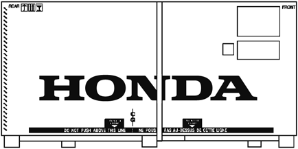
[1]

UNCOVERED CRATE

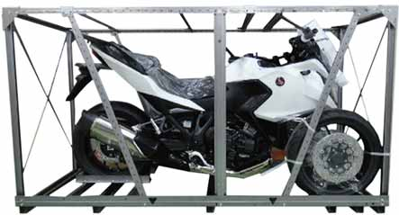
3
dummyhead
2022 NT1100A/D

PARTS CARTON

Cut the straps [1] and remove the front wheel [2] and parts carton [3]
from the crate base.
* Before removing the parts carton on the front wheel side, protect
the motorcycle exterior parts (especially the middle cowl) with a
blanket to prevent damage.

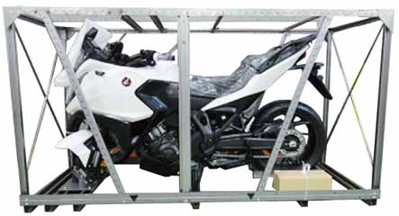
[3]
[1]

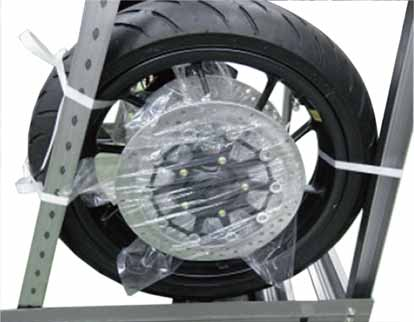
[2]
4
dummyhead
2022 NT1100A/D

SET-UP PARTS

Unpack the remaining loose parts and check them against this
illustration and lists.
4.
3.5.
1./2.
8.
6.7.
9.

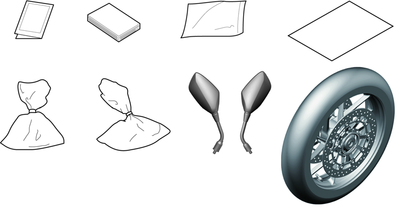

DESCRIPTIONQTYPART NUMBERType
1.Declaration130432-MBW-D26

ED type only
or
30432-MBW-D27
2.MID declaration137911-MKS-E01
3.Owner's manual100X32-MLF-600
(ED type only)
00X33-MLF-600
(ED type only)
00X35-MLF-600
(ED type only)
4.Owner's manual bag1-
5.Protective film138500-MKS-E01Attach to the MID.
6.Special bolt (6 mm)290085-MBW-000For main seat

Plain washer (6 mm)294103-06800

Flange bolt (10 mm)490131-MLF-E00For front brake caliper

Plain washer (6 mm)294103-06800For number plate (FO type
only)

Number plate bracket washer290402-GB0-900For number plate (FO type
only)
7.Side collar244312-MCE-950For front wheel

Front axle bolt190112-MKN-D50
8.Right rearview mirror188110-MKS-E01MT
88110-MKS-E51DCT

Left rearview mirror188120-MKS-E01
9.Front wheel assembly144600-MLF-E00
5
dummyhead
2022 NT1100A/D

CRATE FRAME REMOVAL
* Using two people, carefully lift off the crate frame.
[1]
* Take care not to damage the motorcycle while removing the
crate frame.

Remove the protect coverings from the handlebar grips.

Remove the following:
[4]
–Nuts [1]
–Bridge plates [2]
[2]
–Inner plate [3]

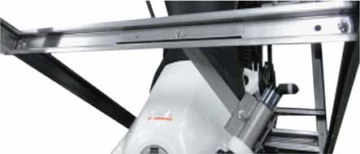
[3]
–Left front clamper [4]
[6]/[7]
–Right front clamper [5]

Remove the front clamper A [6] and B [7] from the grips.
[5]
[3]
[6]/[7]

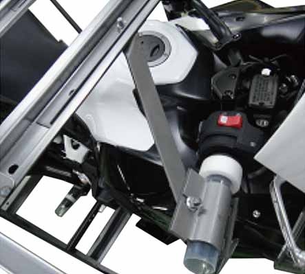

Loosen the upper bolts [1] attaching the crate side braces [2].
[1]
[1]

Remove the lower bolts [3] attaching the crate side braces and ends
from the crate base [4].
* Using two people, carefully lift off the crate frame/side brace to
the right side of the motorcycle.
* Be careful not to damage the motorcycle while removing the
[2]
crate frame/side brace.

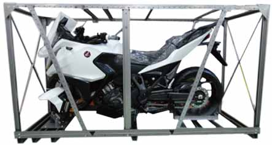
[1][4]
[3]

MOTORCYCLE REMOVAL FROM THE CRATE BASE
* Using two people, carefully to roll the motorcycle.
[1]
* Do not roll the motorcycle off the crate base as it will damage the
body parts.
* Be careful not to damage the fuel tank, wire harness, clutch
cable, or front brake hose with the sling.

Route sling [1] on the handlebar [2] between the handlebar holders.

Be careful not to damage the handlebar or trap any wires, cables or
hoses with the sling.
[2]

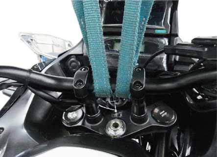
6
dummyhead
2022 NT1100A/D

Hook the slings [1] under the rear carrier [2] as shown.
[1]

Lift the motorcycle just enough to remove the slack from the slings.
[2]

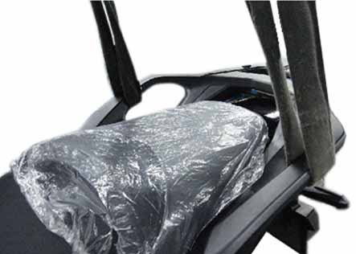

To prevent damage, cover the motorcycle with a blanket [1].
[1]

Lift the motorcycle free of the crate base and remove the base.

Lower the sidestand or the mainstand and place the motorcycle on a
level surface.

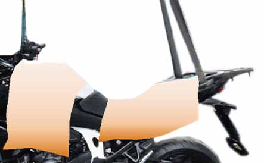

Remove the bolts [1] and the front shipping bracket [2].
[1]

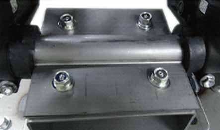
[2]

Remove the following:
[1]
–Rubber cushions [1]
–Front axle cover [2]

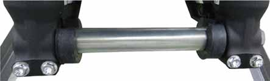
[1]
[2]
7
dummyhead
2022 NT1100A/D

FRONT WHEEL INSTALLATION

PARTSQTY

Front wheel assembly1

Side collar2

Flange bolt (10 mm)4

Front axle bolt1

Loosen the axle holder pinch bolts [1].

Remove the axle [2].
[2]

Remove the dummy caliper mounting bolts [3].

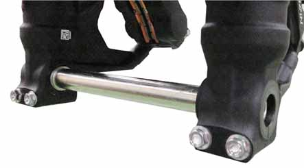
[1]
* Do not reuse the dummy caliper mounting bolts.
[3]

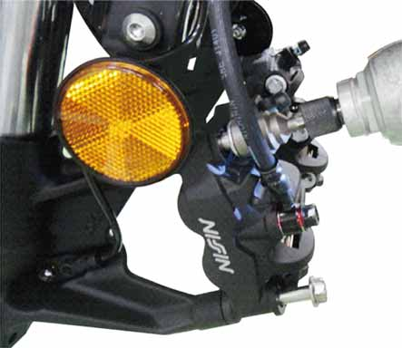

Install the side collars [1].

Right side:Left side:
[1]
[1]

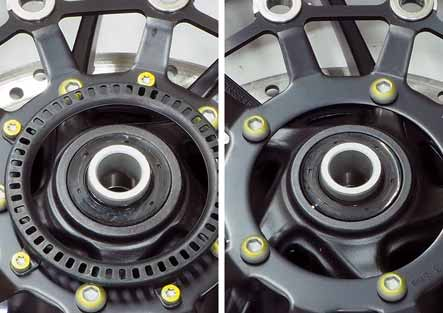

Apply a thin coat of grease to the front axle sliding surface.

Right side:Left side:

Install the front wheel between the forks.
[2]

Install and tighten the front axle bolt [1] to the specified torque.

**TORQUE:****59 N·m** (6.0 kgf·m, 44 lbf·ft)

Tighten the left front axle holder pinch bolts [2] to the specified
torque.

**TORQUE:****27 N·m** (2.8 kgf·m, 20 lbf·ft)
* Be careful not to damage the pulser ring.
* Install the front axle [3] from the right side.
[1]
[3]

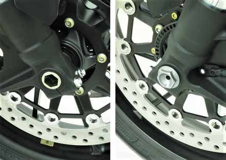
8
dummyhead
2022 NT1100A/D

Install the front brake calipers [1] and new front brake caliper

Right side shown:
mounting bolts [2].

Tighten the front brake caliper mounting bolts to the specified
torque.
**45 N·m** (4.6 kgf·m, 33 lbf·ft)

**TORQUE:**

Tighten the right front axle holder pinch bolts [3] to the specified
torque.

**TORQUE:****27 N·m** (2.8 kgf·m, 20 lbf·ft)
[1]

Check the clearance gap of the 0.70 – 1.30 mm (0.028 – 0.051 in)
between the front wheel speed sensor bracket and pulser ring.
[2]

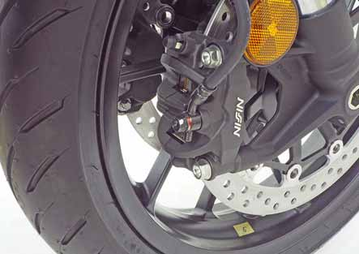
[3]

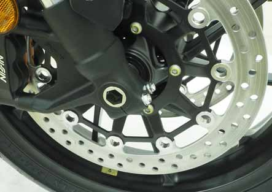
9
dummyhead
2022 NT1100A/D

OWNER’S MANUAL INSTALLATION

PARTSQTY
[1]

Owner’s Manual1

Owner’s manual bag1

Unhook the pillion seat [1] using the ignition key [2].

Remove the pillion seat.
[2]

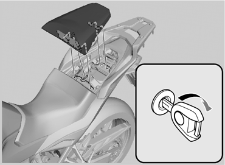

Remove the bolts [1] and washers [2].
[3]
[1]

Remove the main seat [3].
[2]

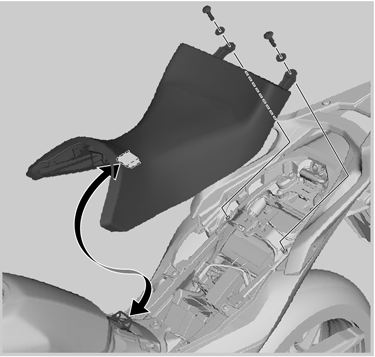

Insert the Owner’s Manual [1] into the owner’s manual bag [2].

Secure the bag and manual with the retaining band [3] on the rear
fender B [4].

Reinstall the main and pillion seats.
[1]
[2]
[3]
[4]

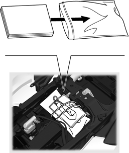
10
dummyhead
2022 NT1100A/D

MIRROR INSTALLATION

PARTSQTY

Right side shown:

Right rearview mirror1

Left rearview mirror1
[1]

Install the rearview mirrors [1].

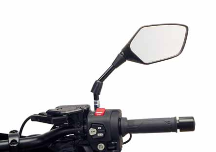

PROTECTION FILM REPLACEMENT

Remove the protection film [1] from the MID.
[1]
* Be careful not to damage the touchscreen.

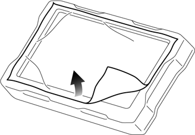

Install the protection film [1] in the following procedure:
[3][4][1]
1.Wipe off dust and any oil on the MID touch screen with a
microfiber cloth.
2.Remove the film A [2] while slowly sticking the protective film as
shown.
3.Remove the film B [3].
* Be careful not to let air bubbles or dust get between the touch
screen and the protective film.
* Push out air bubbles using a spatula [4].
* Do not reuse the protective film once attached to the entire
surface of the touch screen.
[2]

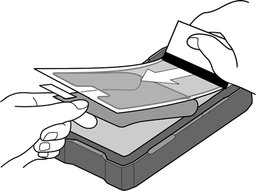
11
dummyhead
2022 NT1100A/D

PRE-DELIVERY SECTION
* How to adjust the clock manually, refer to the website Owner’s

Manual for instructions.

BATTERY INSTALLATION

Remove the main seat (page 10).

Make sure that the ignition switch is turned OFF.

Remove the plastic bag from the battery cables.

Remove the protective cap from the positive (+) terminal.

Follow the instructions as below.
[3]
[4]
* Charge the battery if the battery voltage is below 12.4 V.
* Be sure to measure terminal voltage about one hour after the
battery has been recharged.
* Quick charging should only be done in an emergency; slow
charging is preferred.

Set the terminal nuts to the battery.

Connect the battery positive (+) cable [1] to the positive (+) battery
terminal using the terminal bolt [2].

Connect the battery negative (–) cable [3] to the negative (–) ground
terminal using the terminal bolt [4].
[1]/[2]

Install the main seat.

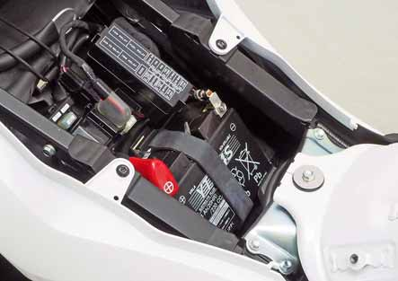
12
dummyhead
2022 NT1100A/D

BRAKE FLUID

FRONT BRAKE RESERVOIR

Place the motorcycle on its mainstand on a level surface.
[4]
[3]

Turn the handlebar so the front brake fluid reservoir is level and
check the brake fluid level through the sight glass [1].

If the fluid level is near the LOWER level line [2], remove the screws
[3], cap [4], set plate [5] and diaphragm [6].

Add DOT 4 brake fluid from a sealed container to bring the level up
to the upper level.
[5]/[6]
* Brake fluid can cause irritation; avoid contact with the eyes and
skin.
* Handle brake fluid with care as it can cause damage to paint and
plastics.
* Check the brake fluid leaks for entire brake system.
[1]
[2]

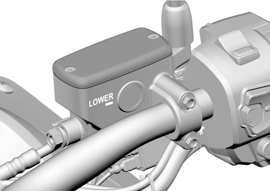

Reinstall the diaphragm, set plate, cap, and screws.

Tighten the screw to the specified torque.

**TORQUE:****1.5 N·m** (0.15 kgf·m, 1.1 lbf·ft)

Operate the brake lever.

If the freeplay is excessive, refer to the Shop Manual and bleed the
system.

REAR BRAKE RESERVOIR

Place the motorcycle on a level surface, and support it in an upright
[4]
[3]
position.

Check the rear brake fluid reservoir level.
[2]

If the level is near the lower level line [1], perform the following:

Remove the bolt [2] and reservoir from the rear frame.

Remove the screws [3], reservoir cap [4], set plate [5] and
diaphragm [6].
[5]/[6]

Add DOT4 brake fluid from a sealed container to bring the level up
to the upper level line [7].
* Brake fluid can cause irritation; avoid contact with the eyes and
skin.
[7]
[1]
* Handle brake fluid with care as it can cause damage to paint and

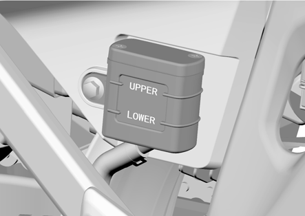
plastics.
* Check the brake fluid leaks for entire brake system.

Install the diaphragm, set plate, reservoir cap, and screws and
tighten the screws to the specified torque.

**TORQUE:****1.5 N·m** (0.15 kgf·m, 1.1 lbf·ft)

Set the reservoir to the rear frame, install the bolt and tighten it to
the specified torque.

**TORQUE:****10 N·m** (1.0 kgf·m, 7 lbf·ft)

Operate the brake pedal.

If the freeplay is excessive, refer to the Shop Manual and bleed the
system.
13
dummyhead
2022 NT1100A/D

PARKING BRAKE (DCT model)

Place the motorcycle on its mainstand on a level surface.
[2]

Turn the rear wheel by hand and slowly pull the parking brake lever.

It is normal that the parking brake starts to work when the end of
lever [1] is between the marks [2] on the cap.
[1]

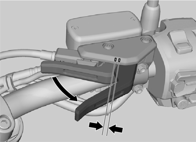

If it does not operate properly, unlock the parking brake by returning
its lever inside fully and measure the length between the brake arm
and cable stay.

STANDARD [1]:35 – 55 mm (1.4 – 2.2 in)

If the measurement is within standard, adjust the adjuster bolt/piston
protrusion at the parking brake caliper (page 14).

If the measurement is out of standard, adjust the cable length at the
cable adjuster (page 15).
[1]

PARKING BRAKE CALIPER SIDE

Unlock the parking brake by returning its lever inside fully.
[1]

Loosen the lock nut [1].

Adjust the adjuster bolt/piston [2] so that the parking brake starts to
work when the end of lever is between the marks on the cap.

Hold the adjuster bolt/piston and tighten the lock nut to the specified
torque.

**TORQUE:****17.2 N·m** (1.8 kgf·m, 13 lbf·ft)
[2]

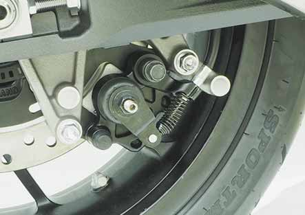
14
dummyhead
2022 NT1100A/D

CABLE ADJUSTER SIDE

Remove the following:
–Middle cowl socket bolt A [1]
–Middle cowl socket bolt B [2]
–Well nut [3]
–Trim clips A [4]
–Trim clip B [5]

Release the bosses [6] from the grommets [7].

Disconnect the front turn signal light 2P connector [8].

Remove the right middle cowl [9] by releasing the tabs [10] from the
side cover and front lower cowl.
[2]
[3]
[7]
[10]
[1]
[10]
[6]
[9]
[4]
[8]

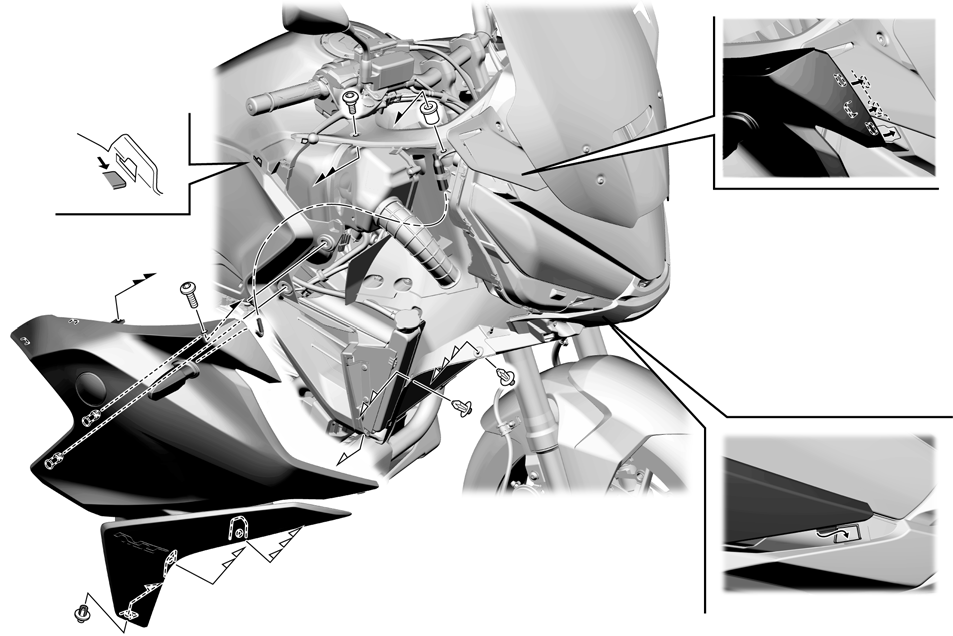
[10]
[5]
15
dummyhead
2022 NT1100A/D

Remove the main seat (page 10).

Remove the trim clips [1], socket bolt A [2] and socket bolts B [3].

Remove the bosses [4] from the grommets [5].

Release the right rear side cowl [6] from the rear center cowl boss
[7].

Remove the right rear side cowl by releasing its tabs [8] with sliding
backward from the rear carrier [9].
* Align the side cover tab [10] with the rear side cowl slot [11]
correctly when installing.
[9]
[10]
[11]

Left side shown:
[8]
[7]
[5]
[4]
[2]
[6]

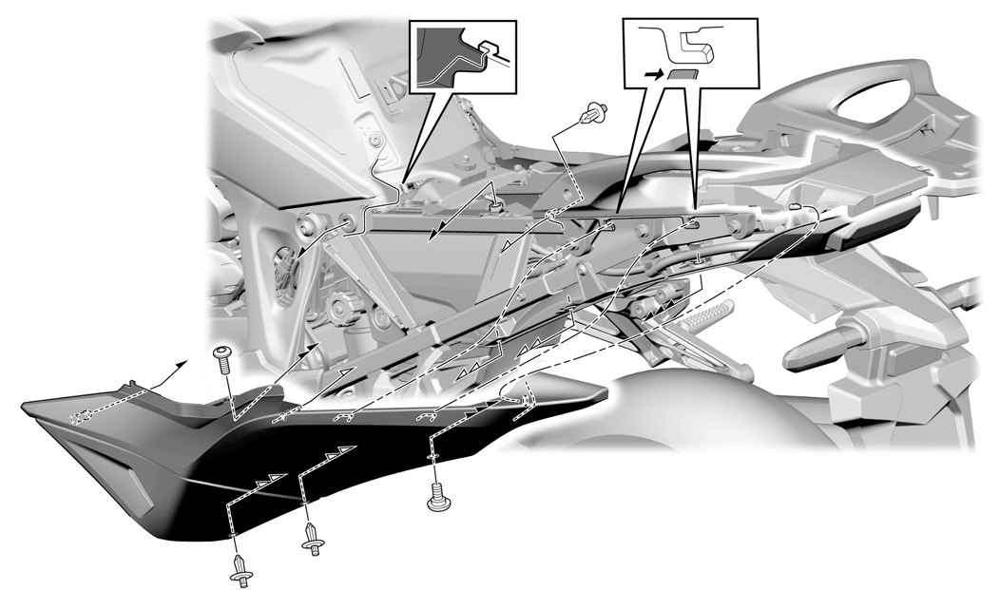
[3]
[1]
* Apply the masking tape [1] around the top of the right rear side

Left side shown:
cowl [2] to prevent any damage when removal/installation.
[1]
[2]

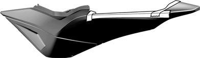
16
dummyhead
2022 NT1100A/D

Remove the following:
–Socket bolt [1]
–Trim clips [2]

Release the bosses [3] from the grommets [4].

Remove the right side cover [5].
[2]
[1]
[4]
[3]
[5]
[2]

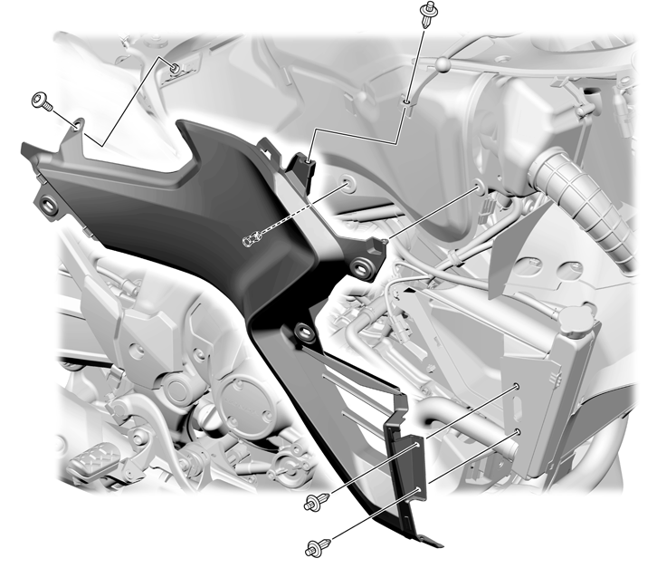
17
dummyhead
2022 NT1100A/D

Unlock the parking brake by returning its lever inside fully.

Slide the boot [1].
[1]

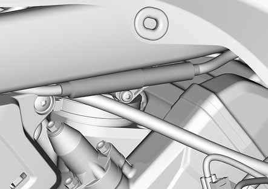

Loosen the lock nut [1] and turn the adjusting nut [2] so that the
[2]
length between the brake arm and cable stay is standard.
[1]

STANDARD [3]:42 mm (1.7 in)

Tighten the lock nut securely.

Install the removed parts in the reverse order of removal.

Adjust the adjuster bolt/piston protrusion at caliper side (page 14).

**TORQUE:**
* Middle cowl socket bolt A: **0.54 N·m** (0.06 kgf·m, 0.4 lbf·ft)

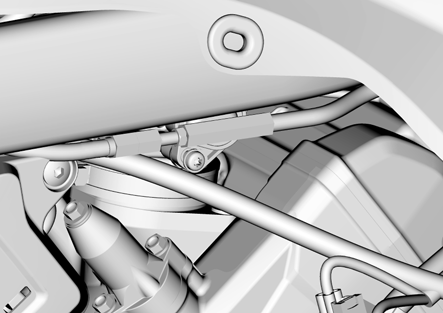
[3]

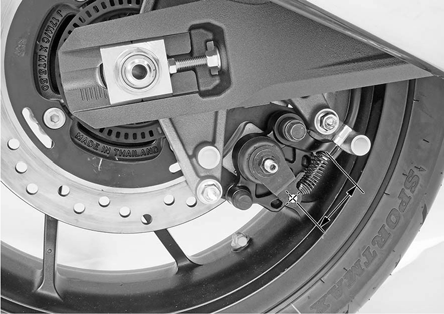

THROTTLE OPERATION

Check for smooth operation of the throttle grip [1] and that it returns
automatically to the fully closed position from any open position and
from any steering position.

Refer to the Shop Manual and clean and apply grease the throttle
pipe-to-APS contacting area if throttle operation is not smooth.
[1]

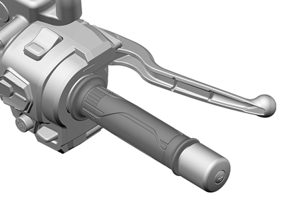
18
dummyhead
2022 NT1100A/D

DRIVE CHAIN SLACK INSPECTION

Turn the ignition switch OFF, support the motorcycle on its
mainstand, and shift the transmission into neutral.

Measure the drive chain slack at the position in the figure.
* While pulling up the drive chain, measure the distance from the
top surface of the swingarm to the drive chain.

**DRIVE CHAIN SLACK:**
70 – 75 mm (2.8 – 3.0 in)

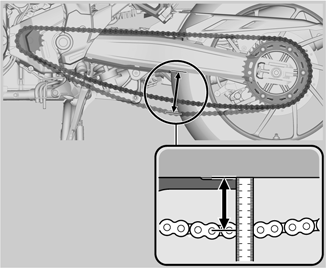

RADIATOR COOLANT

Check the coolant level of the reserve tank with the engine running
at normal operating temperature.

The level should be between the "UPPER" [1] and "LOWER" [2]
level line.

If necessary, add the recommended coolant.

When add the coolant, refer to the Shop Manual.

**RECOMMENDED ANTIFREEZE:**
(Except TH type):

High quality ethylene glycol antifreeze
containing silicatefree corrosion inhibitors

TH type:

Honda PRE-MIX coolant
[1]

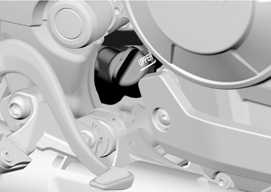

RECOMMENDED MIXTURE (Except TH type):
1:1 (mixture with distilled water)

Check to see if there are any coolant leaks if the coolant level
decreases very rapidly.
[2]

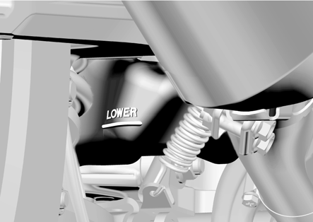
19
dummyhead
2022 NT1100A/D

ENGINE OIL

Before starting the engine, remove the antirust coating from the
engine and exhaust system using a mild detergent and water.

Rinse with clean water.
[1]/[5]

Place the motorcycle on its mainstand.

Remove the dipstick [1].

Make sure that the engine has oil.

Install the dipstick.

Start the engine and let it idle for 3 – 5 minutes.

Stop the engine and wait for 2 – 3 minutes.

Hold the motorcycle in an upright position.
[2]

Remove the dipstick and wipe the oil from the dipstick with a clean
cloth.

Insert the dipstick until it seats, but do not screw it in.

Check that the oil level is between the upper [2] and lower [3] level
[3][4]/[5]
lines on the dipstick.

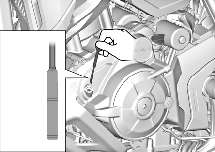

If the level is below the lower level line, remove the oil filler cap [4]
and fill the crankcase with the recommended oil up to the upper
level line.

When replacing the engine oil, refer to the Shop Manual.

**RECOMMENDED ENGINE OIL:**

Honda "4-stroke motorcycle oil" or an equivalent motor oil.

API service classification: SJ or higher

JASO T903 standard: MA

Viscosity: SAE 10W-30

Check that the O-rings [5] of the oil filler cap and dipstick are in good
condition, replace them if necessary.

Apply engine oil to the O-rings.

Install the oil filler caps/dipstick.

CLUTCH LEVER (MT model)

Measure the clutch lever freeplay at the end of the clutch lever.
10 – 20 mm

**FREEPLAY:** 10 – 20 mm (0.4 – 0.8 in)
(0.4 – 0.8 in)

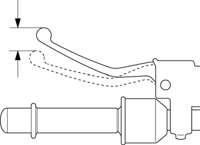
20
dummyhead
2022 NT1100A/D

Major adjustment is made with the lower adjusting nut [1] at the
clutch lifter arm.

Loosen the lock nut [2] and turn the adjusting nut to adjust the
freeplay.

Tighten the lock nut while holding the adjusting nut.

If proper freeplay cannot be obtained, or the clutch slips during test
ride, refer to the Shop Manual and inspect the clutch system.
[1]
[2]

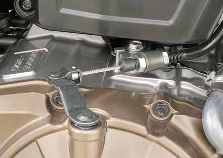

Minor adjustment is made with the upper adjuster at the clutch lever.
[1]

Loosen the lock nut [1] and turn the adjuster [2].

If the adjuster is threaded out near its limit, turn the adjuster all the
way in and back out one turn.
[2]

Tighten the lock nut while holding the adjuster.

Recheck the clutch lever freeplay.

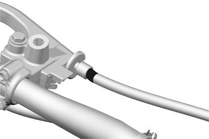

TIRE PRESSURE

Front
2
250 kPa (2.5 kgf/cm
, 36 psi)

Rear
2
290 kPa (3.0 kgf/cm
, 42 psi)
21
dummyhead
2022 NT1100A/D

DECLARATION CONFORMITY (ED type)

Hand the following to the customer.

ED type:
[1]

PARTSQTY

Declaration1

MID declaration1

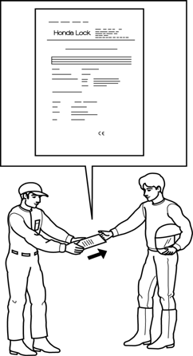
22
dummyhead
2022 NT1100A/D

PRE-DELIVERY SERVICE CHECKLIST

Check all items listed on the following Pre-Delivery Service

Checklist. Refer to Owner’s Manual or Shop Manual for
specifications and detailed procedures.

Always test ride the unit to make sure that it is functioning properly.

Check for front and rear brake operation.

Fill front and rear brakes reservoirs with DOT4 brake fluid, and bleed brake if necessary.

Check the engine oil level and fill crankcase with recommended engine oil if necessary.

When exchanging engine oil, refer to the Shop Manual.

Check coolant level and cooling system for leaks.

When exchanging coolant, refer to the Shop Manual.

Check for MID protective film attached.

Check for clutch operation (MT model).

Check tire pressure.

Inspect all electrical components for proper operation and adjustment.

Check and tighten all nuts, bolts and other fasteners.

Check to ensure that all applicable recall and product update campaigns are complied with as of this date.

**TEST RIDE:** Check performance, handling and operation.

Transmission and clutch: Ease of shifting, clutch operation, etc.

Acceleration: Smoothness, etc.

Cruising: Smoothness, etc.

Handling: Stability and cornering.

Brakes: Smoothness and stopping power.

Idling: Smoothness, throttle response, return to idle.

Speedometer and Tachometer: Proper operation.

Upon completion of test ride, check for fuel, oil or coolant leaks; check fan operation.
23