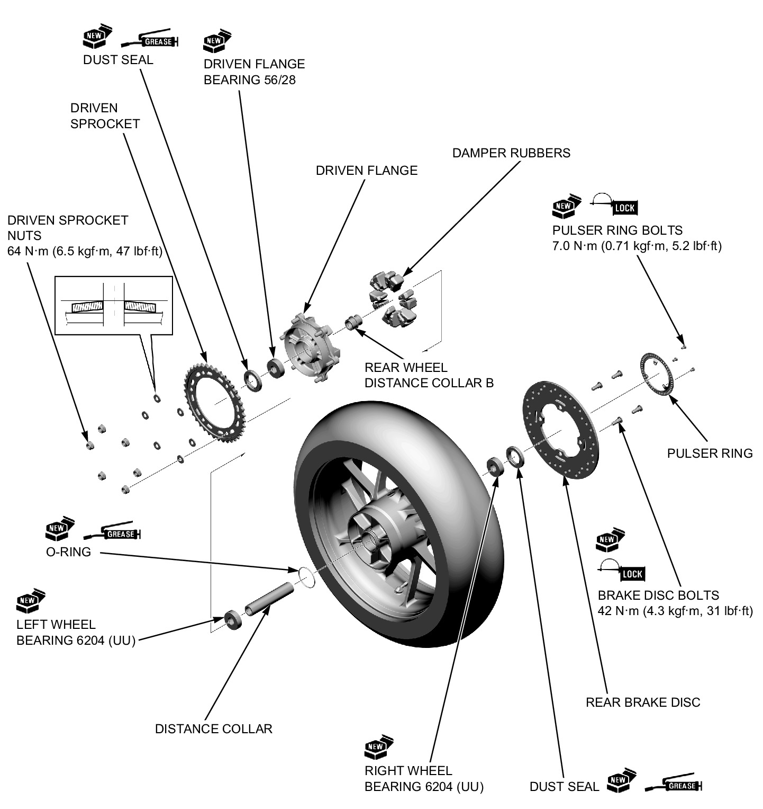

# Wheels - Rear Disassembly&Assembly

DISASSEMBLY/ASSEMBLY

Disassemble and assemble the rear wheel as shown in the following illustration.
* Apply locking agent to the rear brake disk bolt and pulser ring bolt threads.

