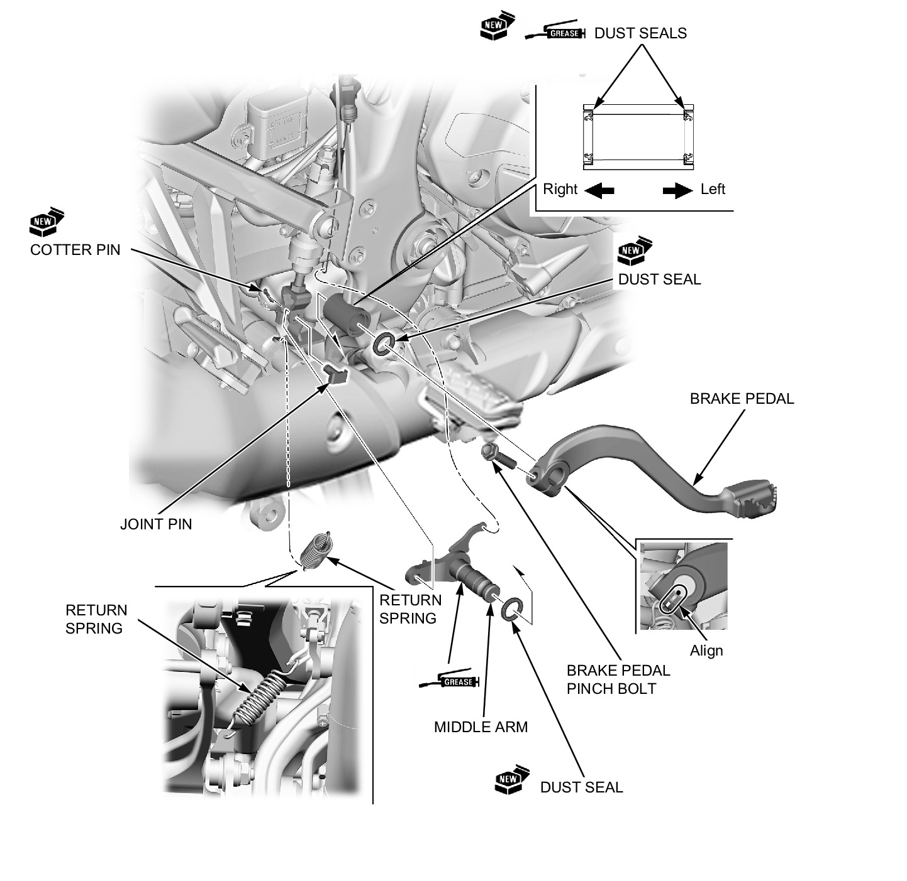

# Brakes - Rear Brake Pedal

REMOVAL/INSTALLATION

Remove the right heel guard.

**NOTE:**
* Align the brake pedal slit with the middle arm punch mark.
* Apply grease to the dust seal lips.
* Apply grease to the middle arm pivot sliding surface.