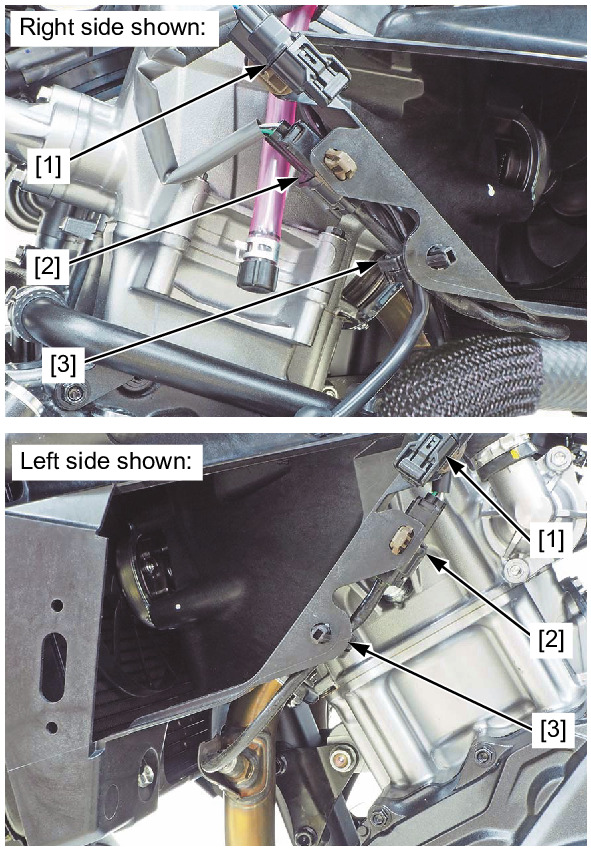
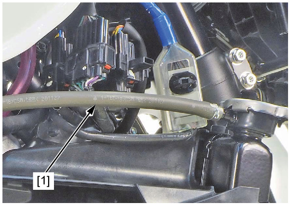
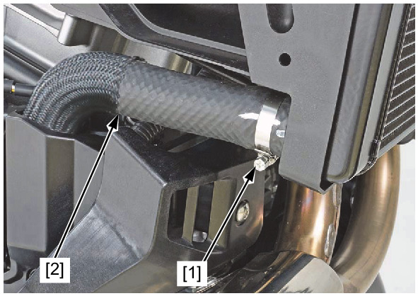
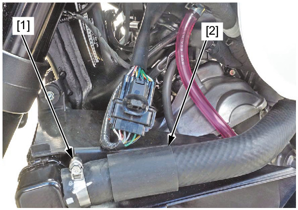
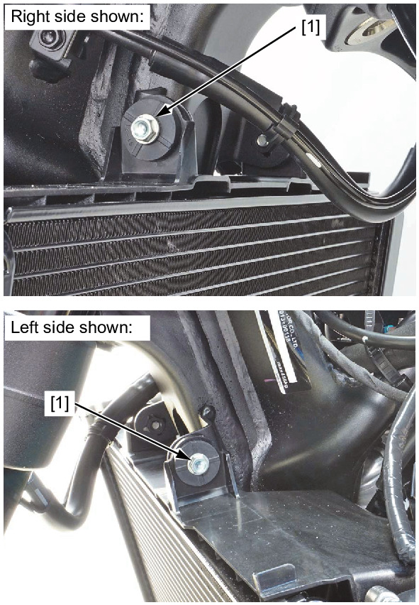
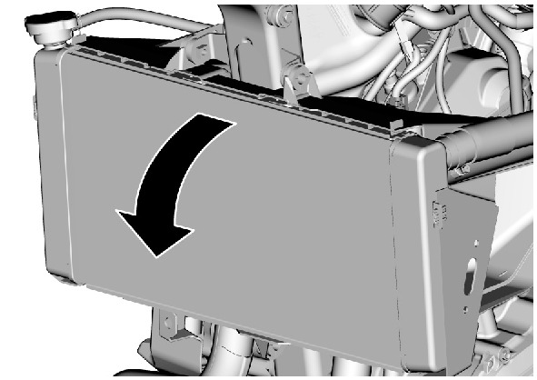
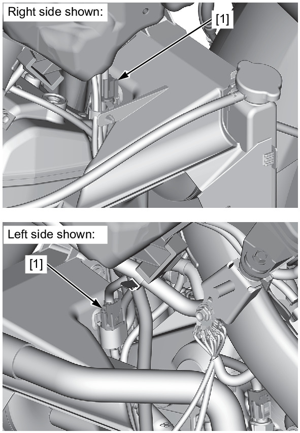
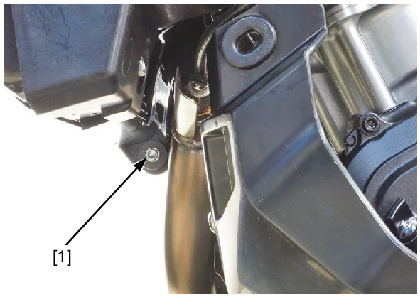
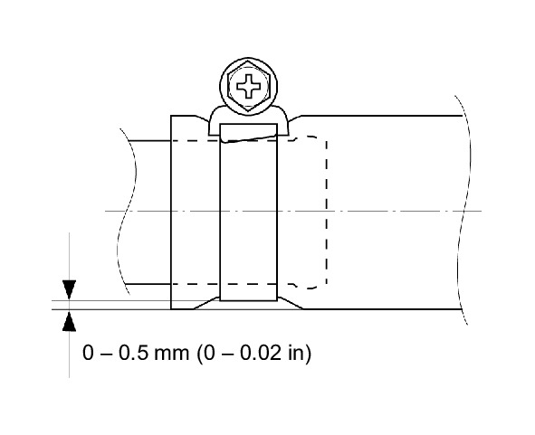

# Coolant-Radiator Remove&Install

REMOVAL/INSTALLATION

Drain the coolant.

Remove the Inner covers.

Release the following from the radiator shroud:
* Fog light 2P (Black) connectors [1]
* A/F sensor 4P (Black) connectors [2]
* Wire clips [3]

Disconnect the siphon hose [1].

Loosen the hose band screw [1].

Disconnect the lower radiator hose [2].

Loosen the hose band screw [1].

Disconnect the upper radiator hose [2].

Remove the bolts [1].

Flip the radiator forward.

Disconnect the fan motor 2P (Black) connectors [1].

Remove the following:

* Bolt [1]
* Radiator

Installation is in the reverse order of removal.

**NOTE:**
* Tighten the water hose band screws to the specified range as shown.
* Route the hoses and wires properly.

Fill the recommended coolant mixture to the filler neck and bleed the air.

