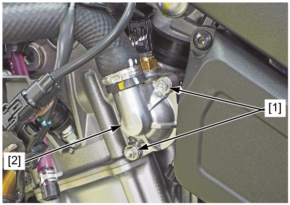
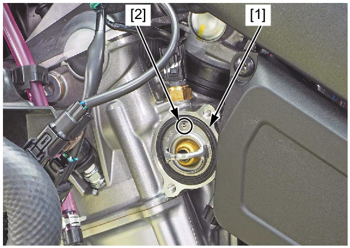

# Coolant-Thermostat Remove&Install

REMOVAL/INSTALLATION

Drain the coolant.

Remove the left side cover.

Remove the thermostat cover bolts [1] and open the thermostat cover [2].

Remove the thermostat [1] from the cylinder head.

Installation is in the reverse order of removal.

**TORQUE:**
* Thermostat cover bolt: **12 N·m** (1.2 kgf·m, 9 lbf·ft)

**NOTE:**
* Install the thermostat with the air bleed hole [2] facing up.

