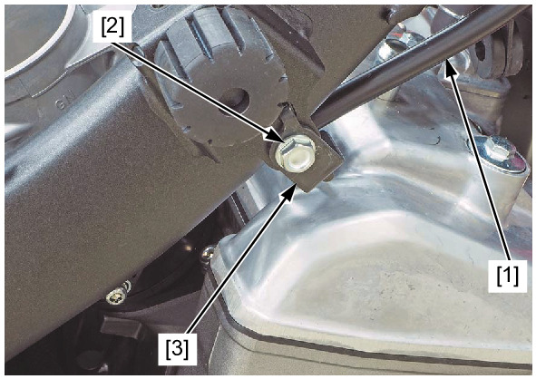
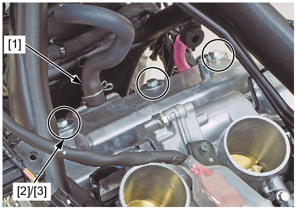
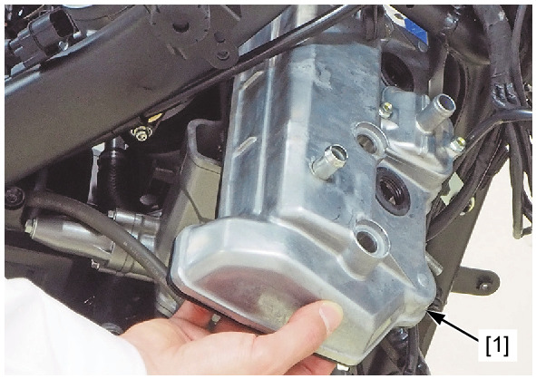
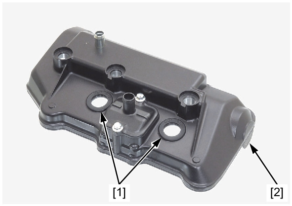

# Cover-Cylinder Head Removal

REMOVAL

Remove the ignition coil tray.

Release the following cable [1] to the clutch cable stay [2].
* Clutch cable (MT model)
* Parking brake cable (DCT model)

Remove the bolt [3] and cable stay.

Disconnect the secondary air supply hose [1].

Remove the cylinder head cover bolts [2] and mounting rubbers [3].

Remove the cylinder head cover [1] to the right side as shown.

Remove the plug pipe seals [1] and cylinder head cover packing [2] from the cylinder head cover.

