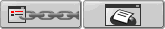
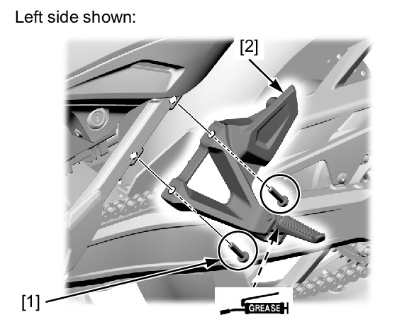

# Frame - Pillion Pegs

Page 1 of 1c0080101 : PILLION STEP > REMOVAL/INSTALLATION

S2MLF000A020027S2MLF000B020041


PILLION STEP > REMOVAL/INSTALL...

Screen History



REMOVAL/INSTALLATION

Remove the pillion step bracket bolts [1] and pillion
step assembly [2].

Installation is in the reverse order of removal.

**TORQUE:**
* Pillion step bracket bolt: **32 N·m** (3.3 kgf·m, 24 lbf·ft)

**NOTE:**
* Apply grease to the pillion step joint pin sliding
area.


