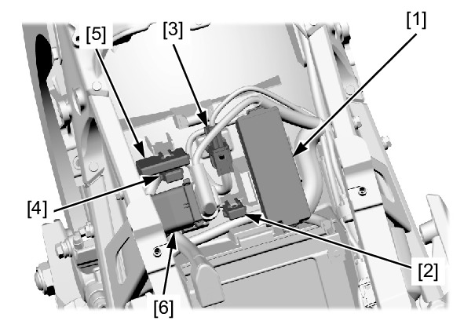
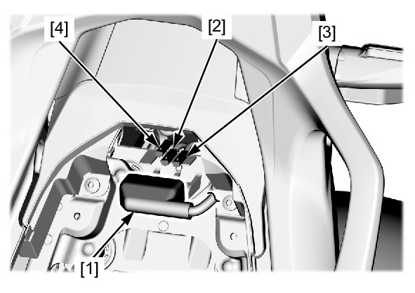
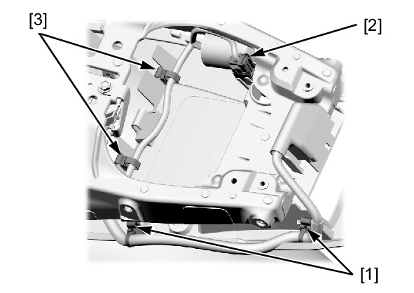
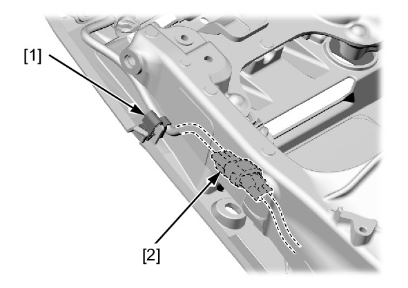
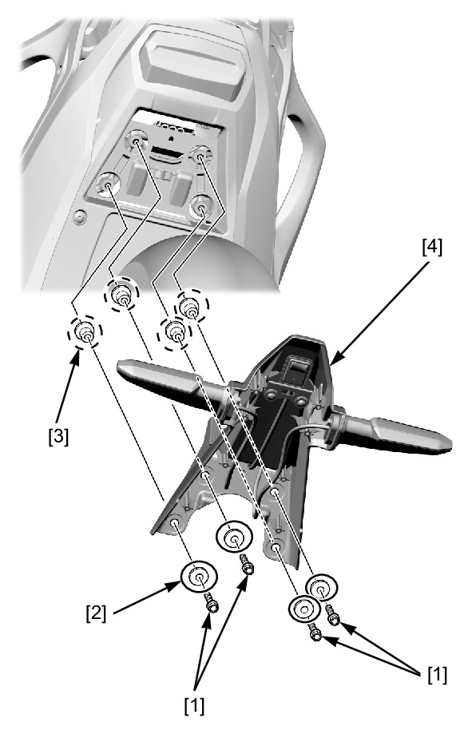
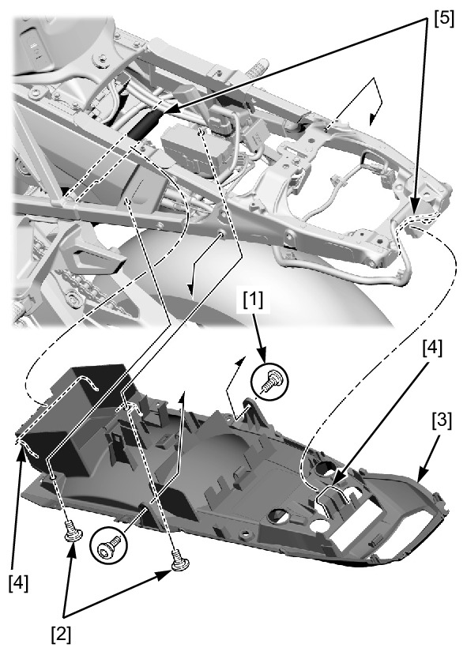

# Frame - Rear Fender B

REMOVAL/INSTALLATION

Remove the following:
* Regulator/rectifier cover
* Rear center cowl
* Brake/taillight
* Rear fender A
* Battery

Release the following from the rear fender B:
* Power box [1]
* ABS FSR fuse box [2]
* Main2, DCT-M (DCT model), FI fuse box connector 4P
(Black) clip [3]
* Main2 fuse box [4]
* DCT-M (DCT model), FI fuse box [5]
* Starter relay switch and cover [6]

Release the connector cover [1] from the stay.

Disconnect the license light 2P [2] and turn signal light 2P
(Orange) [3] /(Light blue) [4] connector.

Release the following from the rear fender B:
* License light, turn signal light harness band clip [1]
* DLC [2]
* Brake/taillight harness band clip [3]

Release the following from the rear fender B:
* Brake/taillight and DLC harness band clip [1]
* Brake/taillight harness connector [2]

Remove the following from the rear fender B:
* Bolts [1]
* Washers [2]
* Collars [3]
* Rear fender A stay [4]

Remove the following:
* Socket bolts A [1]
* Socket bolts B [2]
* Rear fender B [3]

Installation is in the reverse order of removal.

**NOTE:**
* Place the rear fender B hooks [4] onto the seat rail [5].
* Route the wires properly.

