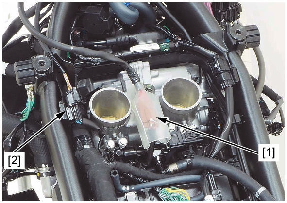
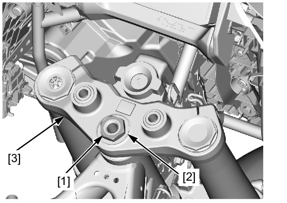
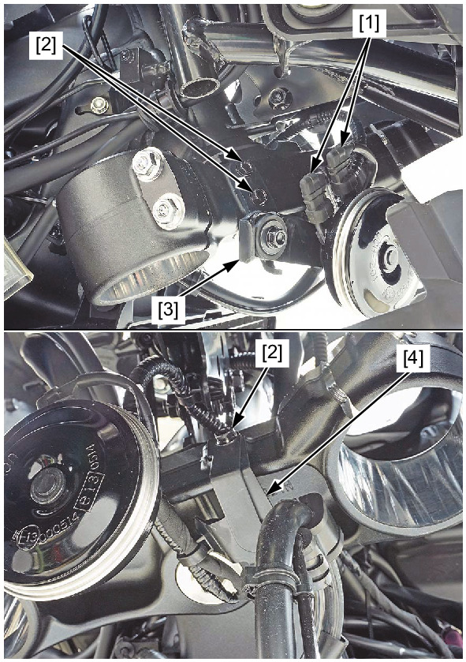
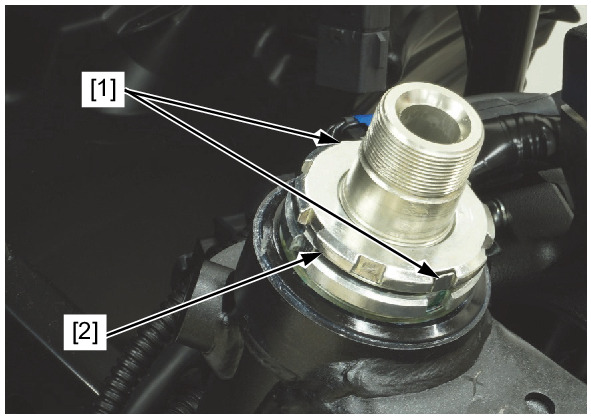
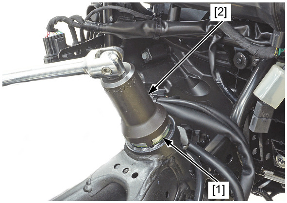
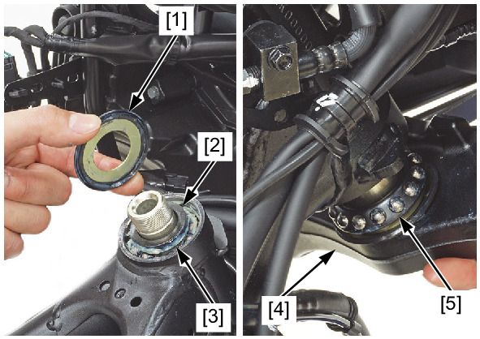

# Front - Steering Stem Remove

REMOVAL

Remove the following:
* Air cleaner housing
* Handlebar lower holder
* Forks

Disconnect the following:
* Ignition switch 2P (Brown) connector [1]
* Immobilizer receiver 4P (Black) connector [2]

Remove the following:
* Steering stem nut [1] and washer [2].
* Top bridge [3]

Disconnect the horn connector [1].

Remove the following:
* Bolts [2]
* Horn stay [3]
* Brake hose clamp [4]

Straighten the lock washer tabs [1].

Remove the lock nut [2] and lock washer.

Loosen and remove the steering stem adjusting nut [1] using the special tool.

**TOOL:**

Locknut wrench 5.8 x 45 [2] 07916-KA50100

Remove the following:
* Upper dust seal [1]
* Upper inner race [2]
* Upper bearing [3]
* Steering stem [4]
* Lower bearing [5]

