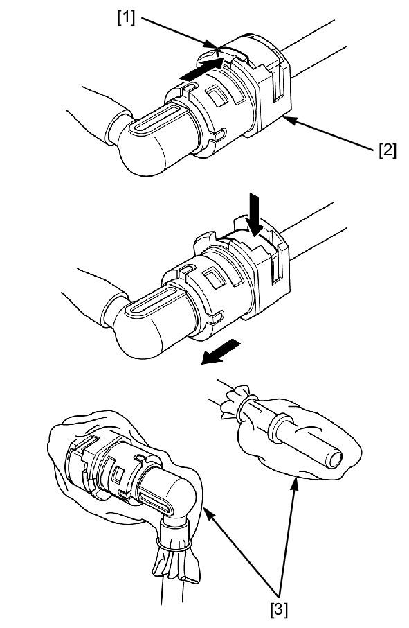

# Fuel - Line Disconnect

QUICK CONNECT FITTING REMOVAL/INSTALLATION

**NOTE:**
* Clean around the quick connect fitting before disconnecting
the fuel feed hose, and be sure that no dirt is allowed to enter
into the fuel system.
* Do not bend or twist the fuel feed hose.

Relieve the fuel pressure.

Disconnect the battery negative (–) cable.

Push the retainer tab [1] forward.

Press down the retainer and disconnect the connector [2] from the
fuel pump joint/fuel rail.

**NOTE:**
* To prevent damage and keep foreign matter out, cover the
disconnected connector and pipe end with the plastic bags [3].

Press the connector onto the fuel pump joint/fuel rail until the
retainer locks with a “CLICK”.

**NOTE:**
* If it is hard to connect, put a small amount of engine oil on the
pipe end.

Make sure the connection is secure; check visually and by pulling
the connector.

Increase the fuel pressure.

