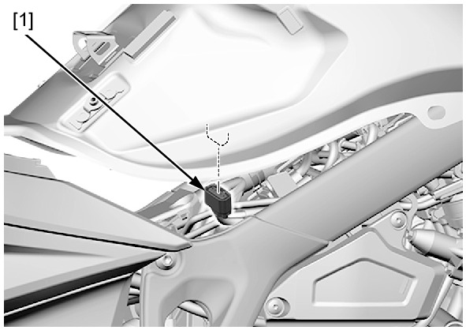

# Fuel - Line Pressure Normalise

FUEL PRESSURE NORMALIZATION
1. Connect the fuel pump unit 5P (Black)
connector [1].

    Connect the battery negative (–) cable.
2. Turn the ignition switch ON.

    The fuel pump will run for about 2 secondsand fuel pressure will rise.

    **NOTE:**
    * Do not start the engine.
3. Turn the ignition switch OFF.
4. Repeat previous step 2 or 3 times, and check that there is no leakage in the fuel supply
system.
5. Install the fuel tank.

