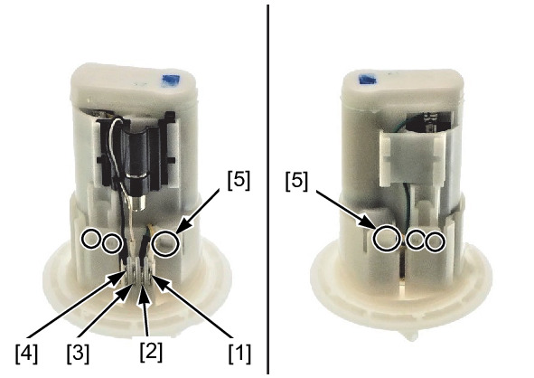
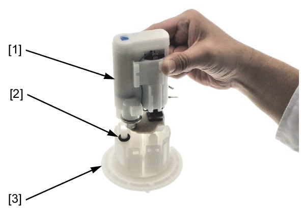
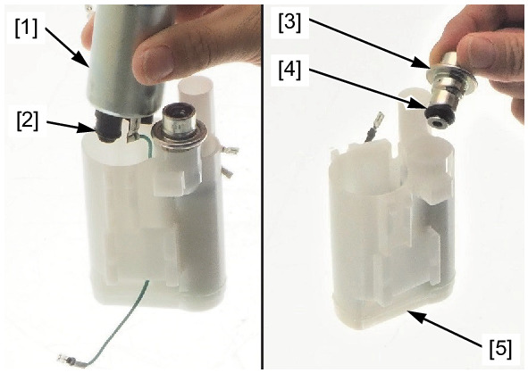

# Fuel - Pump Disassembly

DISASSEMBLY/INSPECTION

Disconnect the following:
* Yellow wire connector [1]
* Green wire connector [2]
* White wire connector [3]
* Black wire connector [4]

Release the tabs [5].

Remove the fuel filter unit [1] and O-ring [2] from the flange [3].

Remove the fuel pump [1] and O-ring [2].

Visually inspect the suction filter for dirt, debris, or any clogging.

Replace fuel pump unit as an assembly if the suction filter is abnormal.

Remove the pressure regulator [3] and O-ring [4] from the fuel filter [5].

