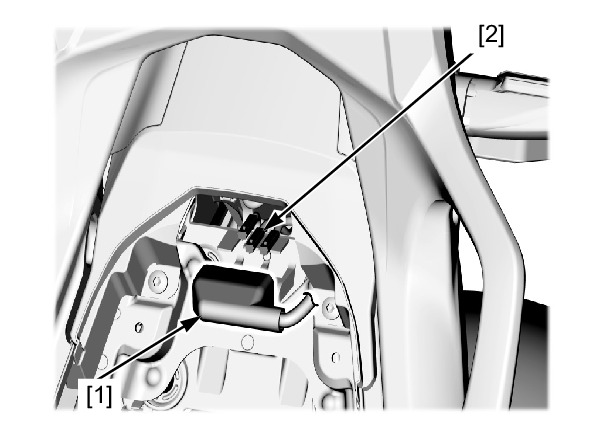
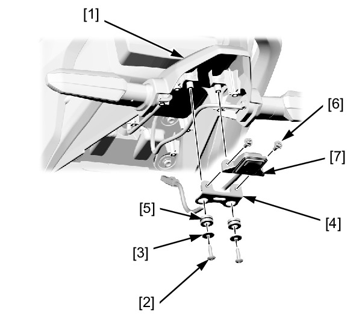

# Lights - License Plate

REMOVAL/INSTALLATION

Remove the following:

* Pillion seat
* Rear fender A

Release the connector cover [1] from the stay.

Disconnect the license light 2P (White) connector [2].

Remove the following from the rear fender A stay [1]:
* Screws [2]
* Washers [3]
* Stay [4]
* Grommets [5]
* License light bolts [6]
* License light [7]

Installation is in the reverse order of removal.

**TORQUE:**
* License light bolt: **2.0 N·m** (0.20 kgf·m, 1.5 lbf·ft)

