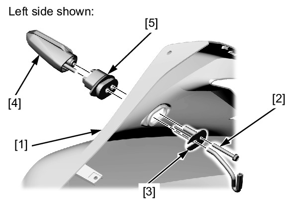
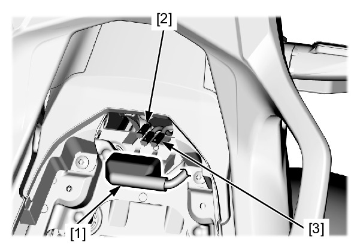
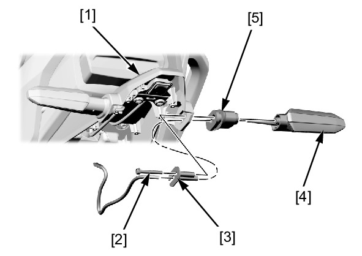

# Lights-Turn Signals

TURN SIGNAL LIGHT REMOVAL/INSTALLATION

FRONT

Remove the middle cowl.

Remove the following from the middle cowl [1]:
* Bolt/washer [2]
* Collar [3]
* Turn signal light [4]
* Grommet [5]

Installation is in the reverse order of removal.

REAR

Remove the following:
* Pillion seat
* Rear fender A

Release the connector cover [1] from the stay.

Disconnect the turn signal light 2P connector:
* Right: light blue [2]
* Left: orange [3]

Remove the following from the rear fender A stay [1]:
* Bolt/washer [2]
* Collar [3]
* Turn signal light [4]
* Grommet [5]

Installation is in the reverse order of removal.

