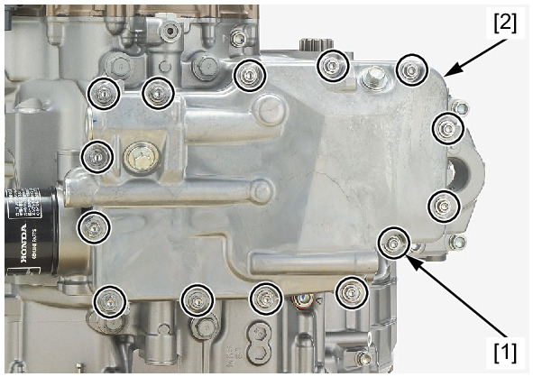
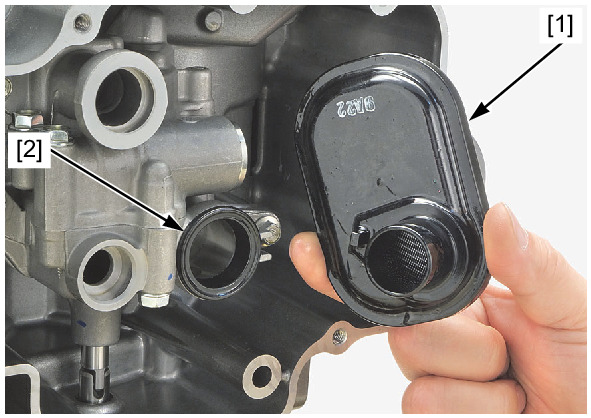
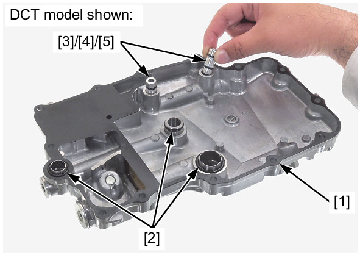
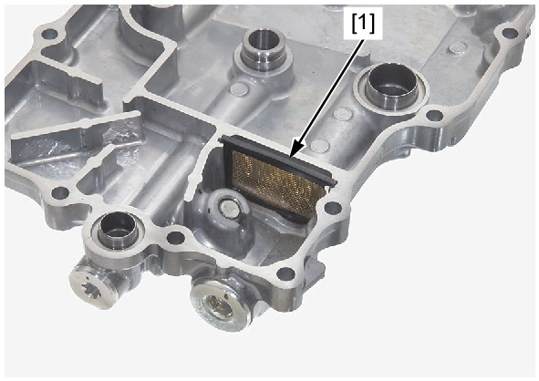

# Oil-Strainer Removal

REMOVAL

Drain the engine oil.

Loosen the bolts [1] in a crisscross pattern in 2 or 3 steps.

Remove the bolts and oil pan [2].

Remove the oil strainer [1] and seal ring [2].

Clean the oil strainer and check for damage, replace it if necessary.

Remove the gasket [1] and O-rings [2] from the oil pan.

Remove the oil joints [3] from the oil pan.

Remove the O-rings [4] and back up rings [5] from the oil joints.

**⚠️ DCT model:**

Remove the oil filter screen [1] from the oil pan.

Clean the oil filter screen and check for damage, replace it if necessary.

