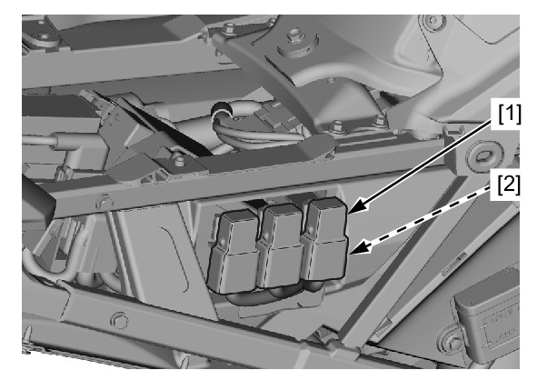

# Relays - Starter

REMOVAL/INSTALLATION

Remove the right rear side cowl.

Release the starter relay [1] from the stay.

Disconnect the relay connector [2] and remove the
starter relay.

Installation is in the reverse order of removal.
* For relay inspection

