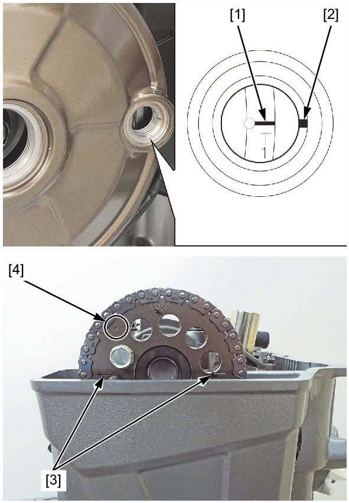
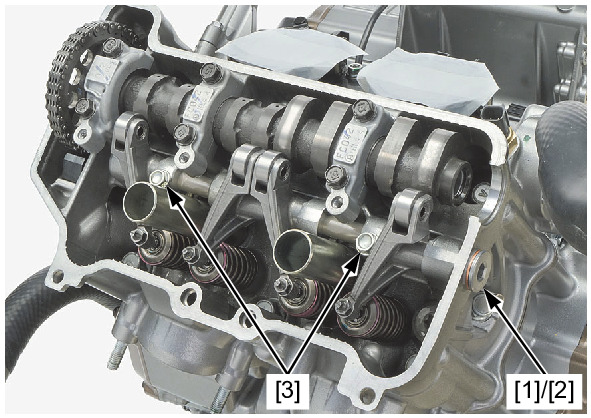
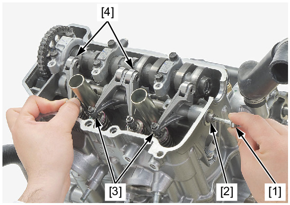

# Rocker Arm - Removal

REMOVAL

Remove the following:
* Cylinder head cover
* Crankshaft hole cap
* Timing hole cap

Turn the crankshaft counterclockwise and align the "T1" mark [1] on the flywheel with the index mark [2] of the alternator
cover.

Make sure that the index lines [3] on the cam sprocket align with the upper surface of the cylinder head and the punch mark
[4] on the sprocket is visible.

Remove the rocker arm shaft stopper bolt [1], sealing washer [2], and rocker arm shaft bolts [3].

Temporarily install the suitable 6 mm bolt [1] to the rocker arm shaft [2].

Remove the rocker arm shaft by pulling suitable 6 mm bolt.

Remove the suitable 6 mm bolt from the rocker arm shaft.

Remove the rocker arms A [3] and B [4].

