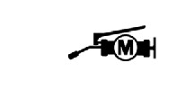
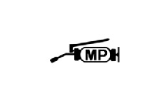
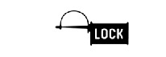
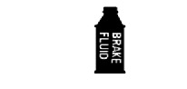
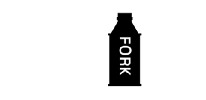

# WShop Manual - Symbols

SYMBOLS

The symbols used throughout this manual show specific service procedures. If
supplementary information is required pertaining to these symbols, it would be explained
specifically in the text without the use of the symbols.  
Replace the part(s) with new one(s) before assembly.

Use the recommend engine oil, unless otherwise
specified.

Use molybdenum oil solution (mixture of the engine oil
and molybdenum grease in a ratio of 1:1).

Use multi-purpose grease (lithium based multi-purpose
grease NLGI #2 or equivalent).

Use molybdenum disulfide grease (containing more than
3% molybdenum disulfide, NLGI #2 or equivalent).  
Example:
* Molykote® BR-2 plus manufactured by Dow Corning

U.S.A.  
Use molybdenum disulfide paste (containing more than
40% molybdenum disulfide, NLGI #2 or equivalent).  
Example:
* Molykote® G-n Paste manufactured by Dow

Corning U.S.A.
* Pro Honda M-77 Assembly Paste (Moly) (U.S.A.

only)
* Rocol ASP manufactured by Rocol Limited, U.K.
* Moly Paste 500 manufactured by Sumico Lubricant,

Japan

Use silicone grease.

Apply a locking agent. Use a medium strength locking
agent unless otherwise specified.

Apply sealant.

Use DOT 4 brake fluid. Use the recommended brake fluid
unless otherwise specified.

Use fork or suspension fluid.

